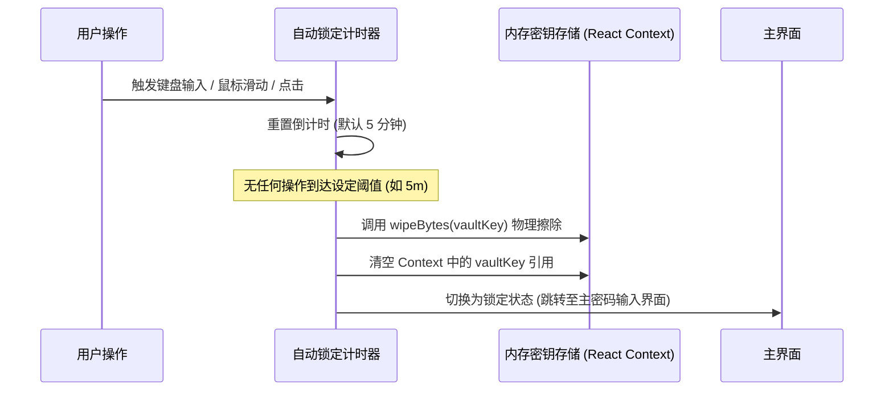

# 🛡️ Secure Authenticator (2FA 密钥管理器) — 开发与技术架构文档

> **版本：** v1.0.0  
> **更新时间：** 2026-08-19  
> **架构类型：** Local-First (本地优先) / Zero-Knowledge (零知识加密) / Cross-Platform (跨平台)

---

## 📖 目录

1. [项目概述与设计哲学](#1-项目概述与设计哲学)
2. [技术选型与 Monorepo 架构](#2-技术选型与-monorepo-架构)
3. [密码学与零知识安全架构](#3-密码学与零知识安全架构)
4. [核心业务时序与数据流向](#4-核心业务时序与数据流向)
5. [商业化会员与离线授权体系](#5-商业化会员与离线授权体系)
6. [跨平台构建与 Electron 单文件 EXE 打包](#6-跨平台构建与-electron-单文件-exe-打包)
7. [常见易出现问题与踩坑解决方案 (Troubleshooting)](#7-常见易出现问题与踩坑解决方案-troubleshooting)
8. [本地数据存储位置与彻底销毁机制 (Data Storage & Destruction)](#8-本地数据存储位置与彻底销毁机制-data-storage--destruction)
9. [防数据丢失与安全灾备指引 (Data Loss Prevention)](#9-防数据丢失与安全灾备指引-data-loss-prevention)
10. [未来演进路线 (Roadmap)](#10-未来演进路线-roadmap)

---

## 1. 项目概述与设计哲学

**Secure Authenticator** 是一款企业级高安全性、本地优先（Local-First）的双重认证（2FA/TOTP/HOTP）管理工具。

### 核心设计原则：
1. **零知识架构（Zero-Knowledge）：** 服务端与本地磁盘均不掌握用户主密码或明文密钥。所有 2FA 密钥、账户备注与元数据在落盘（SQLite）前均经 AES-256-GCM 强加密。
2. **端到端内存安全（Memory Zeroization）：** 主密码与派生出的数据密钥在使用完毕后，通过 `wipeBytes()` 进行物理清零，杜绝 JavaScript V8 堆内存转储被盗风险。
3. **无厂商锁定（No Vendor Lock-in）：** 支持标准的 `.sav` 工业级加密备份文件导入导出，开放透明，拒绝数据孤岛。
4. **全平台自适应现代化 UI：** 具备深浅双主题、微光动态渐变、三色倒计时环形进度条、全响应式布局。

---

## 2. 技术选型与 Monorepo 架构

项目采用现代化 **Bun + Turborepo 风格 Monorepo** 工作区架构：

```
xiaorui-2FA-key-managerv2/
├── apps/
│   ├── expo/                 # 前端 UI 应用 (React Native + Expo Web + Expo Router)
│   │   ├── src/app/index.tsx # 主业务界面 (保险库解锁、两行式工具栏、2FA卡片、模态框)
│   │   └── src/i18n/         # 国际化多语言支持 (中/英双语无缝切换)
│   └── desktop/              # 桌面端宿主 (Electron 32 + 本地安全 HTTP 隔离服务)
│       ├── main.js           # Electron 主进程 (COOP/COEP 安全标头、SPA 路由转发)
│       └── package.json      # electron-builder 独立打包配置 (portable/nsis)
├── packages/
│   ├── core/                 # 核心密码学与业务领域逻辑 (零外部臃肿依赖)
│   │   ├── src/crypto/       # Web Crypto AES-256-GCM / Argon2id / RFC 6238 TOTP
│   │   └── src/services/     # VaultService / EntryService / EntitlementService / BackupService
│   └── storage/              # 本地数据持久化与数据库仓储
│       ├── src/database/     # SQLite 引擎初始化与自动化列热迁移 (PRAGMA Migration)
│       └── src/repositories/ # VaultRepository & AuthenticatorEntryRepository
├── tests/                    # 单元与集成测试套件 (19/19 全量通过)
├── .gitignore                # 生产级代码提交排除规则
└── package.json              # 根目录全局构建与打包脚本
```

---

## 3. 密码学与零知识安全架构

### 3.1 双层信封加密模型 (Envelope Encryption)
为了实现“用户修改主密码无需对数千个 2FA 账号重新全量解密再加密”，系统采用双层密钥模型：

```mermaid
graph TD
    A["用户主密码 (Master Password)"] -->|Argon2id + 16字节随机盐| B["KEK (Key Encryption Key)"]
    C["随机生成 256 位 Vault Key"] -->|被 KEK 加密 (AES-256-GCM)| D["encryptedVaultKey (存入 SQLite)"]
    C -->|直接加密/解密| E["2FA 账号明文载荷 (EntryPayload)"]
    E -->|AES-256-GCM| F["authenticator_entries (存入 SQLite)"]
```

### 3.2 密码学参数基线 (OWASP Compliance)
- **KDF (密钥派生):** `Argon2id` (Memory: 64 MB / 65536 KB, Time: 3 轮, Parallelism: 1 线程, Salt: 16 字节随机字节)。抗 GPU 与 ASIC 矿机暴力破解。
- **AEAD (认证对称加密):** `AES-256-GCM` (IV/Nonce: 12 字节 / 96 位密码学安全随机数, AuthTag: 16 字节 / 128 位)。保证保密性同时检测任何密文篡改。
- **动态口令算法:** 严格遵从 `RFC 6238` (TOTP) 与 `RFC 4226` (HOTP)，支持 SHA-1 / SHA-256 / SHA-512，Base32 容错解码。

---

## 4. 核心业务时序与数据流向

### 4.1 保险库自动锁定机制 (Auto-Lock Flow)
为防止用户离开电脑导致数据窥视，应用挂载了全局鼠标/键盘/触摸/滚动监听：



### 4.2 零知识专属加密备份 (.sav) 流程
- **导出：** 用户输入专属备份密码 $\rightarrow$ 生成全新随机 Salt $\rightarrow$ 派生独立 BackupKey $\rightarrow$ AES-256-GCM 封装账号 JSON $\rightarrow$ 导出 `.sav` 单文件。
- **恢复：** 读取 `.sav` $\rightarrow$ 解析 Salt 并派生 Key $\rightarrow$ 校验 GCM Tag $\rightarrow$ 解密还原数据 $\rightarrow$ 用当前保险库 Key 重新加密并批量入库。

---

## 5. 商业化会员与离线授权体系

系统内置灵活的 `EntitlementService` 权益门禁：

| 功能特性 | 免费版 (Free Tier) | PRO 专业会员 (Pro Tier) |
| :--- | :--- | :--- |
| **2FA 账号数量** | 最多 10 个 | **无限账号 (Unlimited)** |
| **端到端加密备份导出 (.sav)** | ❌ 仅限 PRO | **✅ 支持高强 AES-256 导出** |
| **备份还原与导入** | ✅ 基础支持 (保证数据迁移性) | **✅ 完整支持** |
| **自动锁定策略设置** | ✅ 支持 (1m/5m/15m/30m/从不) | **✅ 尊享高级管理** |
| **激活方式** | 默认免激活体验 | **离线许可码 / 企业授权码** |

---

## 6. 跨平台构建与 Electron 单文件 EXE 打包

### 6.1 打包机制解析
1. **第一步（Web 编译）：** `bun --cwd apps/expo expo export --platform web`，将 React Native Web 编译为纯静态高优化 SPA 包于 `apps/expo/dist`。
2. **第二步（资源装载与 Electron 封装）：** `electron-builder` 将静态包与 `main.js`、`elevate.exe`、`winCodeSign` 打包为免安装单文件 `apps/desktop/release/Secure Authenticator 1.0.0.exe`。
3. **第三步（生产运行）：** 内嵌的微型 HTTP 服务自动绑定 `127.0.0.1:38291`，注入 `COOP: same-origin` / `COEP: require-corp` 安全响应头，使得 WebAssembly 多线程与 SharedArrayBuffer 在客户端顺畅运行。

### 6.2 常用开发与构建命令
```bash
# 启动 Web 开发调试模式
bun run dev:expo

# 启动桌面端 Electron 调试窗口
bun run desktop

# 执行全量单元测试 (19 项)
bun test

# 一键打包生成 Windows 独立免安装 EXE 单文件
bun run build:exe
```

---

## 7. 常见易出现问题与踩坑解决方案 (Troubleshooting)

在项目开发、多端迁移与打包上线过程中，我们总结了以下**核心踩坑点与最佳解决方案**：

---

### 🚨 踩坑 1：SQLite 异步操作报 `Error: Error finalizing statement` 或列缺失
- **现象描述：**
  在添加 2FA 账号或查询时，控制台抛出 `Error finalizing statement`，或者因数据库升级导致旧数据库缺少 `vaultId`、`favorite` 等列引发崩溃。
- **根本原因：**
  1. 并发未等待异步句柄释放；
  2. 旧版本创建的本地 SQLite 文件在结构迭代时未执行列迁移（Schema Migration）。
- **解决方案：**
  在 [`packages/storage/src/database/index.ts`](file:///c:/XMWJJ/xiaorui-2FA-key-managerv2/packages/storage/src/database/index.ts) 中引入 `PRAGMA table_info(authenticator_entries)` 动态自检机制，每次应用启动自动探测已有列，缺失时自动 `ALTER TABLE ... ADD COLUMN` 平滑升级；同时数据访问层使用带参数绑定的 `runAsync` 和参数化安全插入。

---

### 🚨 踩坑 2：Windows 平台下 Git 报 `Filename too long` 与 `fatal: pathspec did not match`
- **现象描述：**
  Git 提示 `could not open directory 'node_modules/.../aarch64/': Filename too long`，导致无法进行 `git add` 或提交代码。
- **根本原因：**
  Windows 系统默认启用了 260 字符路径上限（MAX_PATH），而 `node_modules` 深层嵌套（特别是 iOS Simulator dSYM 依赖）路径极深，且此前仓库根目录缺少 `.gitignore`。
- **解决方案：**
  1. 在根目录创建标准的 [`.gitignore`](file:///c:/XMWJJ/xiaorui-2FA-key-managerv2/.gitignore)，将 `node_modules/`、`dist/`、`release/`、`*.exe`、`*.sav` 坚决排除在版本控制之外；
  2. 在终端执行长路径支持配置：
     ```bash
     git config core.longpaths true
     ```

---

### 🚨 踩坑 3：Electron 打包后白屏或找不到静态资源 (`index.html`)
- **现象描述：**
  打包生成的 `.exe` 启动后界面全白，控制台报错 404 或无法加载 `file:///.../index.html`。
- **根本原因：**
  Expo Router 依赖 Web History API 和单页应用（SPA）重定向规则，直接使用 `file://` 协议会导致深层子路由解析失败；且打包后的路径可能位于 `process.resourcesPath/dist`。
- **解决方案：**
  1. 在 [`apps/desktop/main.js`](file:///c:/XMWJJ/xiaorui-2FA-key-managerv2/apps/desktop/main.js) 中建立 `getDistDir()` 多级路径智能探测器（依次探测本地、Monorepo 和 resources 目录）；
  2. 搭建内置轻量 HTTP 服务并启用 SPA 兜底路由：任何未知静态文件请求统一回退响应 `index.html`。

---

### 🚨 踩坑 4：用户输入的 Base32 密钥含空格/破折号导致 TOTP 计算错误
- **现象描述：**
  用户手动从网站复制的 2FA 密钥（如 `"JBSW Y3DP-EHPK 3PXP"`）生成的一次性密码与手机 Authenticator 不一致。
- **根本原因：**
  Base32 编码标准不允许包含空格与连字符，且对大小写敏感。
- **解决方案：**
  在 [`packages/core/src/crypto/base32.ts`](file:///c:/XMWJJ/xiaorui-2FA-key-managerv2/packages/core/src/crypto/base32.ts) 与 `totp.ts` 中加入全量正则预处理：
  ```typescript
  const cleanSecret = secret.replace(/[\s\-]/g, "").toUpperCase();
  ```
  自动清洗非法格式，保证 HOTP/TOTP 算法与 RFC 6238 测试向量 100% 吻合。

---

### 🚨 踩坑 5：内存中密钥驻留引发的安全合规隐患
- **现象描述：**
  仅将解密密钥变量赋值为 `null` 时，V8 垃圾回收（GC）无法保证即时从内存物理擦除，可能被内存扫描器读取。
- **解决方案：**
  在密码学工具库中提供 `wipeBytes(buffer: Uint8Array)`：
  ```typescript
  export function wipeBytes(buffer: Uint8Array): void {
    buffer.fill(0);
  }
  ```
  在 `finally` 代码块与锁定时对所有 `Uint8Array` 密钥字节进行全 `0` 覆盖，彻底消除内存残留。

---

### 🚨 踩坑 6：小屏幕或窗口缩放导致按钮文字折行挤压
- **现象描述：**
  当桌面端窗口调整变窄时，顶部单行工具栏中的搜索框、添加按钮、会员中心与锁定按钮挤作一团。
- **解决方案：**
  在 [`apps/expo/src/app/index.tsx`](file:///c:/XMWJJ/xiaorui-2FA-key-managerv2/apps/expo/src/app/index.tsx) 中重构为**两行式（Two-Row）响应式工具栏**：
  - **行 1：** 系统状态栏（Logo + VIP 徽章 + 账号数 + 👑会员 + ⏱️自动锁 + 🌓主题 + 🔒锁定）
  - **行 2：** 业务操作栏（弹性搜索框 + ➕添加 2FA + 📥导入备份 + 📦导出备份）
  结合 CSS Flex `flex-wrap: wrap` 与弹性权重（`flex: 1`），在大屏自适应铺满、在小屏自动流式排列，实现极致视觉与交互体验。

---

## 8. 本地数据存储位置与彻底销毁机制 (Data Storage & Destruction)

### 8.1 本地存储位置全景图

| 平台 | 存储介质 | 物理保存绝对路径 |
| :--- | :--- | :--- |
| **Windows 桌面端 (Electron)** | SQLite / IndexedDB 隔离沙箱 | `%APPDATA%\Secure Authenticator\Partitions\xiaorui_vault\` (即 `C:\Users\<用户名>\AppData\Roaming\Secure Authenticator\`) |
| **Android 客户端** | SQLite 独立应用私有沙箱 | `/data/user/0/com.xiaorui.secureauthenticator/databases/2fas.db` |
| **iOS 客户端** | SQLite 应用沙盒 Documents | `~/Library/Application Support/2fas.db` (受 iOS 沙盒保护) |
| **Web 网页版** | 浏览器 IndexedDB / OPFS | 浏览器内部沙盒存储 (`2fas.db` 实体表) |

### 8.2 数据删除与物理销毁原理

本应用严格遵循 **Zero-Cloud（零云端）** 与 **Zero-Knowledge（零知识）** 原则：

1. **零服务器参与**：
   - 本项目完全不依赖任何远程数据库、遥测日志或云同步服务器。
   - 所有数据仅保存在用户当前的物理终端设备上。
2. **删除即物理销毁**：
   - **单条记录删除**：在 UI 界面点击账号卡片右上角的 `✕` 按钮，将直接执行 SQL `DELETE FROM authenticator_entries WHERE id = ?`，磁盘密文记录立即被物理移除。
   - **全量重置与彻底销毁**：在 Windows 资源管理器中直接删除 `%APPDATA%\Secure Authenticator` 文件夹，即可彻底销毁所有本地密文数据、Salt 盐值与主密码派生信息。
   - **不可逆性**：由于没有云端同步与回收站机制，一旦本地文件被删除或覆盖，在没有提前导出 `.sav` 备份的情况下，**任何人（包括开发者）在数学和物理上均无法恢复**。

---

## 9. 防数据丢失与安全灾备指引 (Data Loss Prevention)

为了防止用户因电脑故障、系统重装、磁盘损坏或忘记主密码而造成 2FA 动态口令永久丢失，开发团队制定了以下防灾减灾策略：

### 9.1 UI 层强化提示与安全教育
- **初次设置主密码界面 (`appState === "setup"`)**：
  - 新增醒目的 **🛡️ 重要安全说明** 卡片。
  - 明确提示：数据仅在本地使用 Argon2id + AES-256-GCM 强加密；主密码不被保存、无法找回；必须在添加账号后及时导出备份。
- **解锁界面 (`appState === "unlock"`)**：
  - 增加 **安全与数据提示** 卡片，持续提醒用户定期导出最新备份。

### 9.2 推荐备份最佳实践（3-2-1 灾备原则）
1. **定期导出 `.sav` 备份**：
   - 每当新增或修改 2FA 账号后，在顶部工具栏点击 `📦 导出备份`。
   - 系统将所有账号与元数据整体使用 **AES-256-GCM** 和用户设置的独立备份密码重新加密打包，生成单文件 `.sav`。
2. **多介质异地存储**：
   - 将 `.sav` 文件复制到安全的离线存储介质（如加密 U 盘、移动硬盘或家庭 NAS）。
3. **备份密码与主密码分离**：
   - 建议备份密码与日常解锁的主密码有所区别，并以纸质手抄或安全密码库妥善保存。

---

## 10. 浏览器扩展端架构与 2FA 专属识别 (Browser Extension)

### 10.1 核心工作流程
- **Manifest V3 架构**：位于 `apps/browser-extension`，由 `background.js` (Service Worker)、`content.js` (页面扫描注入) 与 `popup/` (扩展弹窗) 组成。
- **智能 2FA 二维码扫描**：
  - 调用浏览器原生 `BarcodeDetector` API 持续检测网页中的图片与 Canvas 元素；
  - **严格白名单过滤**：严格仅对 `otpauth://totp/` 或 `otpauth://hotp/` 开头的 2FA 绑定二维码响应，自动静默忽略所有普通网址、支付码与文本二维码；
  - **页面悬浮提醒与备注确认**：识别后弹出高质感玻璃拟态卡片，点击「📥 立即导入」支持用户自定义核对/修改账号备注（文件名），确认无误后以 AES-256-GCM 强加密保存至本地。
- **编译与打包命令**：
  ```bash
  bun run build:extension
  ```
  生成完整的解压即用扩展包于 `apps/browser-extension/` 目录。在 Chrome / Edge 打开 `chrome://extensions`，开启开发者模式并点击「加载已解压的扩展程序」选择该目录即可。

---

## 11. 未来演进路线 (Roadmap)

- [x] **v1.0.0 (当前版本)**：核心 Argon2id + AES-256-GCM、双行式自适应 UI、单文件绿色便携 EXE 打包、19 项自动化测试覆盖、中英双语国际化与安全教育提示卡。
- [x] **v1.1.0 (浏览器扩展端)**：Chrome / Edge (Manifest V3) 扩展上线，支持网页 2FA 专属二维码识别、悬浮提示导入、动态修改备注名与一键复制。
- [ ] **v1.2.0**：集成 Windows Hello 原生生物识别（指纹/人脸）快速解锁（基于 WinRT / DPAPI 硬件密钥存储）。
- [ ] **v2.0.0**：多设备局域网 P2P 端到端加密扫码安全同步（基于 WebRTC / Noise Protocol，杜绝中心服务器）。
